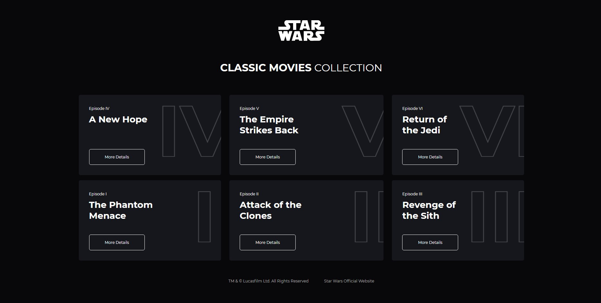
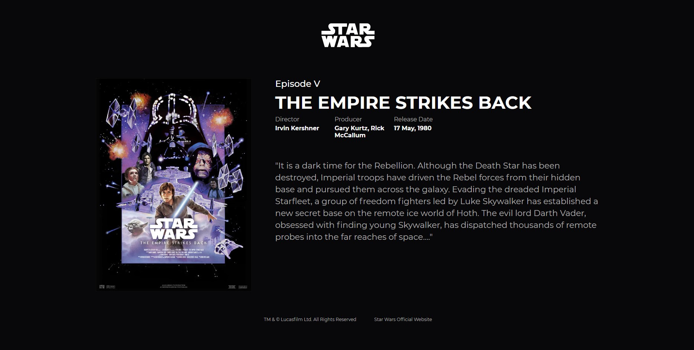
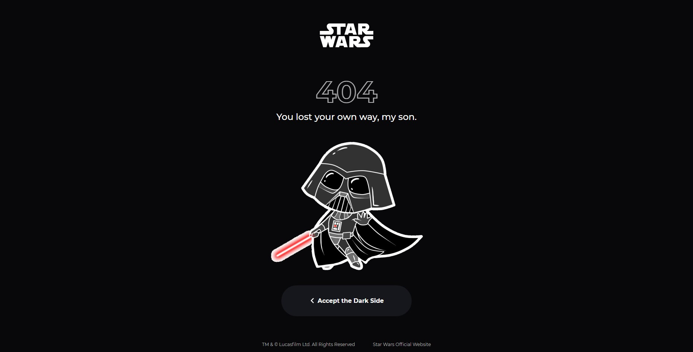
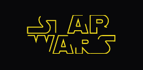

<div style="display: flex; justify-content: space-between;">
  
  
  
</div>


<h1 id="about">Star Wars Challenge</h1>

<p>📌 Este projeto tem o intuito de consumir uma APi pública de filmes e dinamicamente mostrar os títulos da franquia Star Wars, repeitando o layout fornecido e as tecnicas de SEO.<p>
<p>Desafio realizado durante o processo seletivo da Intermobile</p>

<p align="center">
 <a href="#preview">Prévia</a> •
 <a href="#technologies">Tecnologias</a> •
 <a href="#installation">Como usar</a>
</p>

<h2 align="left" id="preview">💻 Preview </h2>

<p>Clique na imagem abaixo para acessar o layout no Figma</p>
<a target="_blank" href="https://www.figma.com/file/zEEo0BgHhrIIV6FgjvfJAz/Intermobile-%7C-Front-End-Challenge?node-id=18%3A25"></a>


<p>Clique na imagem abaixo e acesse uma prévia da aplicação diretamente na hospedagem da Vercel</p>
<a target="_blank" href="https://star-wars-challenge-seven.vercel.app"></a>


<h2 align="left" id="technologies">📐 Tecnologias </h2>

As seguintes ferramentas foram usadas na construção do projeto:

- [Next.JS](https://nextjs.org)
- [React](https://pt-br.reactjs.org)
- [TypeScript](https://www.typescriptlang.org/)
- [Styled Components](https://styled-components.com)


<h2 align="left" id="installation">🚀 Inicializando a aplicação</h2>

### Pré-requisitos

Antes de começar, você vai precisar ter instalado em sua máquina as seguintes ferramentas:
[Git](https://git-scm.com), [Node.js](https://nodejs.org/en/).
Além disto é bom ter um editor para trabalhar com o código como [VSCode](https://code.visualstudio.com/)

### 🎲 Rodando o Front End

```bash

# Clone este repositório
$ git clone https://github.com/GabrielTurra/star-wars-challenge.git

```
### 🌎 Com o repositório clonado, siga os seguintes passos:

```bash

# Acesse a pasta do projeto no terminal/cmd
$ cd star-wars-challenge

# Inicia o Next, automaticamente baixa todas as dependências
$ yarn dev

# O servidor inciará na porta:3000 - acesse http://localhost:3000

```
